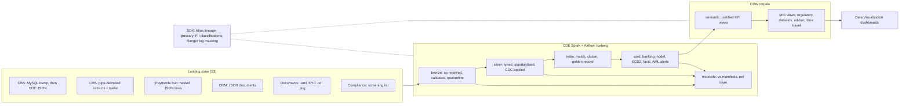

# General Data Lakehouse

A small, governed banking lakehouse on Cloudera, for demos. Six synthetic source systems land
files: a MySQL dump, then CDC events, pipe-delimited extracts with control trailers, nested
JSON, e-mails and scanned documents, and a compliance screening list. CDE Spark carries them
through bronze, silver, MDM and gold on Iceberg. The result is a banking data model (Customer,
Deposits, Lending, Payments, plus AML added as an extension) with SCD Type 2 dimensions and one
golden customer record. It feeds three certified KPIs (NPA exposure, CASA ratio, customer
relationship value), and MIS dashboards, ad-hoc queries and regulatory datasets all read the
same definitions. Every batch is reconciled against the sources' own control figures, and a
batch that fails halfway can be re-run.

About 1,000 customers and 5 business days (2026-09-21 to 2026-09-25), so a full run takes
minutes on the cluster or on a laptop.



## Where things are

| Path | What |
|---|---|
| `cde/jobs/` | The CDE Spark jobs, one per stage: `land_sources.py` (the source systems), `ingest_bronze.py`, `build_silver.py`, `build_mdm.py`, `build_gold.py`, `reconcile.py`; `mdm_live.py` for the live golden-record demo; shared helpers in `gdl_common.py` |
| `cde/dags/gdl_dag.py`, `cde/scripts/` | The Airflow DAG (one run per business date) and the deploy scripts |
| `contracts/` | One data contract per source entity: format, key, columns, types, checks |
| `config/` | `pipeline.json` (dates, entities, endpoints), `kpi.json` (certified KPI definitions and parameters), `aml_rules.json`, `governance.json`, `profiler_tag_rules.json` (Data Catalog auto-classification) |
| `model/source_mapping.csv` | Source of every gold column, rendered in [docs/BANKING_MODEL.md](docs/BANKING_MODEL.md) |
| `sql/semantic/` | Certified KPI views, MIS views, regulatory datasets, dashboard views (one SQL dialect for Impala and Spark) |
| `sql/adhoc.sql`, `sql/time_travel.sql` | Ad-hoc questions (Hue) and Iceberg time travel |
| `scripts/` | `run_local.py` (the jobs on local Spark), `run_semantic.py` (the semantic layer and KPI consistency check, Impala or Spark), `governance.py` (Atlas and Ranger), `profiler_rules.py` (profiler tag rules: render, check on Impala), `render_mapping.py` |
| `dataviz/` | The dashboards as code, and the export file they build |
| `tests/` | pytest: contracts, generator, parsers, SQL portability, governance config, docs |

## Run it on a laptop

Needs Python 3.11 and Java 17.

```bash
python -m venv .venv && .venv/bin/pip install -r requirements-dev.txt
.venv/bin/python -m pytest -q
.venv/bin/python scripts/run_local.py all --warehouse /tmp/gdl/w --landing /tmp/gdl/l
.venv/bin/python scripts/run_local.py adhoc time-travel --warehouse /tmp/gdl/w --landing /tmp/gdl/l
```

`run_local.py all` lands the five dates, then runs every stage date by date and the semantic
layer on Spark SQL, on an Iceberg JDBC catalog under `--warehouse`. CI (GitHub Actions) runs the
same, then the KPI consistency check and the failed-batch drill.

## Run it on Cloudera

See [docs/DEMO_RUNBOOK.md](docs/DEMO_RUNBOOK.md): deploying the CDE jobs and the DAG, one batch
per business date, the semantic layer on Impala, governance, dashboards, and what to show.

## Documents

| Document | About |
|---|---|
| [PLAN.md](PLAN.md) | Requirements map, platform mapping, design, decisions |
| [docs/BANKING_MODEL.md](docs/BANKING_MODEL.md) | Entities, canonical keys, SCD2, golden record, source mappings, extending the model (AML) |
| [docs/FAILED_BATCH_DEMO.md](docs/FAILED_BATCH_DEMO.md) | A batch that dies mid-write: what it leaves, the mismatch report, the re-run |
| [docs/GOVERNANCE.md](docs/GOVERNANCE.md) | PII classifications, Ranger masking, auto-classification with Data Catalog profilers, the KPI glossary, lineage |
| [capabilities/](capabilities/README.md) | One document per capability: what it does, how it is built, and how to see it working |
| [docs/PROFILER_TAG_RULES.md](docs/PROFILER_TAG_RULES.md) | Creating the seven profiler tag rules in the Data Catalog UI, with screenshots |
| [docs/DATAVIZ.md](docs/DATAVIZ.md) | The four dashboards, build, import and verify |
| [docs/DEMO_RUNBOOK.md](docs/DEMO_RUNBOOK.md) | Deploy, run and present the demo |
| [docs/PRESENTER_RUNBOOK.md](docs/PRESENTER_RUNBOOK.md) | Slide by slide: the commands, jobs and queries to show each slide live |
| [docs/PROJECT_LOG.md](docs/PROJECT_LOG.md) | What ran on the cluster, and the results |

All data is synthetic. No credentials are kept in the repository: the scripts read them from
environment variables (`GDL_IMPALA_*`, `GDL_WORKLOAD_*`, `GDL_VIZ_API_KEY`), and `.env` is
ignored by git.
