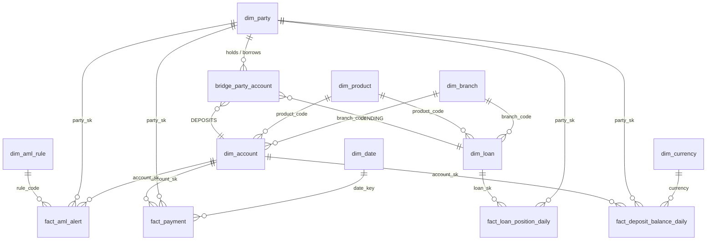

# C09. Banking data model and extension methodology

## Summary

Yes: five domains in `rsingh_gdl_gold`, built by `cde/jobs/build_gold.py` each business date:
**Customer**, **Deposits**, **Lending**, **Payments**, and **AML**. AML was added last, as the
worked example of the extension method. They share five conformed dimensions and join only
through canonical keys. Three dimensions are SCD2. Every gold column (224) has a source mapping
row, and the job fails if one is missing.

The reference is [`docs/BANKING_MODEL.md`](../docs/BANKING_MODEL.md): the ER diagram, keys, SCD2,
survivorship, the full mapping tables and the extension steps.

## Domains and entities

| Domain | Entities | Rows (after 2026-09-25) | Grain |
|---|---|---|---|
| Customer | `dim_party` (SCD2), `bridge_party_account` | 1,136 versions; 1,840 | a golden customer version; party to account or loan, with role PRIMARY, JOINT or BORROWER |
| Deposits | `dim_account` (SCD2), `fact_deposit_balance_daily` | 1,504; 7,269 | account version; account per day |
| Lending | `dim_loan` (SCD2), `fact_loan_position_daily` | 362; 1,802 | loan version; loan per day (outstanding, overdue, DPD, SMA, IRAC class, provision) |
| Payments | `fact_payment` | 7,514 | one own-account payment (channel, direction, INR amount, fees and GST, counterparty bank) |
| AML (extension) | `dim_aml_rule`, `fact_aml_alert` | 4; 18 | rule; rule and subject per day |
| Conformed | `dim_date`, `dim_branch`, `dim_product`, `dim_currency`, `dim_party` | 4,748; 12; 9; 4 | shared by every domain |

`dim_date` carries the Indian fiscal year (April to March). Facts are partitioned by
`business_date`, and a run replaces its date in one Iceberg commit.

## Relationships



The bridge is what makes the customer view work: a joint account belongs to two parties, and a
borrower's loan sits next to their deposits. The CRV KPI (customer relationship value) is built
on it.

## Canonical keys

| Key | Form | Source of truth |
|---|---|---|
| `party_id` | MDM id, stable across runs | `mdm.party_xref`, the only path from any source customer id to a party (C08) |
| `account_key` | `ACC:CBS:<acct_no>` | core banking accounts; also the own side of a payment |
| `loan_key` | `LN:LMS:<loan_id>` | the loan system |
| `branch_code`, `product_code`, `currency_code` | the CBS codes | core banking dump and CDC |
| `date_key` | `yyyymmdd` | `dim_date` |
| `party_sk`, `account_sk`, `loan_sk` | `xxhash64(key, version)` | the SCD2 version a fact row was valid against |

The keys carry the system they come from (`ACC:CBS:`, `LN:LMS:`), so a second loan system adds
`LN:<SYS>:` without collisions. A record whose customer MDM could not resolve goes to the
`UNKNOWN` party, not dropped, and reconciliation explains each such row.

## SCD2 treatment

| Dimension | Tracked attributes (a change opens a version) |
|---|---|
| `dim_party` | full name, date of birth, gender, PAN, mobile, e-mail, address, pincode, city, segment, KYC status, home branch |
| `dim_account` | owner party, joint party, product, branch, currency, status, close date, interest rate |
| `dim_loan` | borrower party, product, branch, interest rate, tenure, EMI, restructured flag, status |

Columns: `version`, `effective_from`, `effective_to` (`9999-12-31` while open), `is_current`,
`record_hash`, `change_reason` (NEW, CHANGED, REAPPEARED), `changed_attributes`, `end_reason`
(SUPERSEDED, REMOVED_AT_SOURCE), and the source record behind each version. Facts join the
version valid on their date. Example, Shreya Naidu (`P0A4F2E33DF8E`): v1 NEW from 2026-09-21;
v2 from 09-23, address and pincode changed; v3 from 09-24, address changed again, from her own
change-request e-mail. C05 covers the full SCD2 behaviour, including late-arriving data.

The branch, product and currency dimensions are type 1 (reference data, current values).

## Source mappings

`model/source_mapping.csv`: one row per gold column with source system, entity, field,
transform type (ingest, cleanse, standardise, deduplicate, match, enrich, normalise, aggregate,
historise) and the rule. Enforced: `build_gold.py` fails if it writes a column without a row.
It is loaded into `rsingh_gdl_ref.source_mapping` and rendered into `docs/BANKING_MODEL.md` by
`scripts/render_mapping.py`, and `tests/test_docs.py` fails if the two differ.

Six source systems feed the model: core banking (CBS), loans (LMS), CRM, payments, documents
(KYC and change requests) and compliance (the AML watchlist).

## Walkthrough (about 8 minutes)

**1. The model (2 min).** `docs/BANKING_MODEL.md` on GitHub: the ER diagram renders. Walk the
five domains and the conformed dimensions.

**2. The keys and the bridge (2 min).** One customer across domains:

```sql
SELECT b.`role`, b.domain, b.account_key
FROM rsingh_gdl_gold.bridge_party_account b
WHERE b.party_id = 'P97F981593876';

SELECT p.full_name, a.account_key, f.business_date, f.balance_inr
FROM rsingh_gdl_gold.fact_deposit_balance_daily f
JOIN rsingh_gdl_gold.dim_party p ON p.party_sk = f.party_sk
JOIN rsingh_gdl_gold.dim_account a ON a.account_sk = f.account_sk
WHERE p.party_id = 'P97F981593876' ORDER BY f.business_date;
```

Arun Agarwal: one deposit account as PRIMARY and two loans as BORROWER, all on one party.
(`role` is a reserved word in Impala, hence the backticks.)

**3. SCD2 (1 min).**

```sql
SELECT party_id, version, effective_from, effective_to, is_current, change_reason, changed_attributes
FROM rsingh_gdl_gold.dim_party WHERE party_id = 'P0A4F2E33DF8E' ORDER BY version;
```

**4. Mappings (1 min).**

```sql
SELECT target_column, source_system, source_entity, source_field, transform_type, rule
FROM rsingh_gdl_ref.source_mapping WHERE target_table = 'fact_loan_position_daily';
```

**5. The extension method, with AML (2 min).** The table below: AML added new tables and
joined the existing ones by key, without changing them.

## The extension methodology

A new domain is added in the order data flows, and joins the model only through conformed
dimensions and canonical keys.

| Step | What to add | AML, as done |
|---|---|---|
| 1. Source | the extract on landing, with its manifest (counts, control totals) | `compliance/<date>/aml_watchlist_<yyyymmdd>.csv` |
| 2. Contract | `contracts/<entity>.json` (types, mandatory, patterns, allowed values, severity) | `contracts/aml_watchlist.json` |
| 3. Bronze | nothing: the ingest job reads any contract (validation, quarantine, drift, trailer, audit) | `bronze.aml_watchlist` |
| 4. Silver | a standardiser, reusing the shared ones (`std_name`, `name_key`, `std_pan`) | watchlist state table, MERGEd by entry id (handles delisting) |
| 5. Reconciliation | a check where the domain has a control figure | alerts checked against planted truth |
| 6. Gold | dimensions and facts that join by `party_sk`, `account_sk`, `branch_code`, `date_key`; rules in `config/` | `dim_aml_rule` from `config/aml_rules.json`; `fact_aml_alert` |
| 7. Mappings | a row per new column, or the job fails | 29 rows |
| 8. Governance | nothing if PII columns use the standard names: the tagger tags them, the masks apply | watchlist name, PAN, date of birth masked for federal01 and federal07 |
| 9. Consume | a semantic view and a dashboard | `semantic.dash_aml_alert`; dashboard "GDL AML Alerts" |
| 10. Tests | the generic tests cover a new entity; add one for its planted data | `test_aml_patterns_and_screening_hits_are_planted` |

The four AML rules: cash structuring (3 or more cash deposits of 40,000 to 49,999.99 in 3
days), pass-through (8 or more credits of 50,000 or more, 90% out the same day), screening on
PAN (CRITICAL), screening on name and date of birth (HIGH). A namesake with another date of
birth must not alert, and reconciliation checks that.

## Common questions

- **"Is this BIAN or FSLDM?"** A dimensional model aligned to their domains (party,
  arrangement / account, product, location / branch, event / transaction). The canonical keys
  and the bridge map onto BIAN's party and arrangement concepts. A full industry model would
  sit at silver, with these marts derived from it.
- **"Next domain?"** Cards or trade finance: a contract, a standardiser, `dim_card` (SCD2)
  and `fact_card_txn` joining by `party_sk` and `date_key`, plus mapping rows. Nothing existing
  changes.
- **"Why are branch and product type 1?"** They are reference data and history isn't needed
  for the KPIs. Making one SCD2 is a call to the same `scd2` function in `build_gold.py`
with its tracked attributes, as `dim_account` does.
