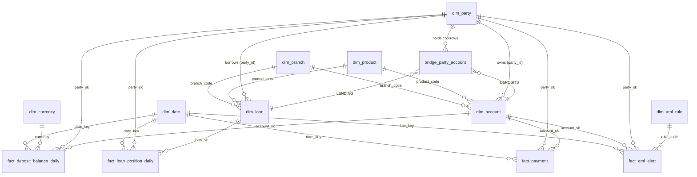

# Banking data model (gold)

`rsingh_gdl_gold`, built by `cde/jobs/build_gold.py` for one business date at a time from
silver and MDM as the batch committed them. Five domains: **Customer**, **Deposits**,
**Lending**, **Payments**, and **AML**, which was added afterwards as the worked example of
extending the model (see [Extending the model](#extending-the-model-aml-as-the-worked-example)).

## Entities and relationships

| Kind | Tables |
|---|---|
| Conformed dimensions (every domain) | `dim_date` (Indian fiscal year, April to March), `dim_branch`, `dim_product`, `dim_currency`, `dim_party` (SCD2) |
| Customer | `dim_party`, `bridge_party_account` (role PRIMARY, JOINT or BORROWER) |
| Deposits | `dim_account` (SCD2), `fact_deposit_balance_daily` |
| Lending | `dim_loan` (SCD2), `fact_loan_position_daily` (outstanding, overdue, DPD, SMA status, IRAC asset class, provision) |
| Payments | `fact_payment` (own-account payments: channel, direction, INR amount, fees and GST, counterparty bank) |
| AML (extension) | `dim_aml_rule`, `fact_aml_alert` |

Facts are partitioned by `business_date`; a run replaces its date's partition in one Iceberg
commit, so re-running a date never duplicates rows.

## Canonical keys

| Key | Form | Comes from |
|---|---|---|
| `party_id` | MDM id (stable across runs) | `mdm.party_xref`, the only way any layer gets from a source customer id to a party |
| `account_key` | `ACC:CBS:<acct_no>` | silver `cbs_account`, `pay_transaction` (the own side of a payment) |
| `loan_key` | `LN:LMS:<loan_id>` | silver `lms_loan_daily` |
| `branch_code`, `product_code`, `currency_code` | the CBS codes | CBS dump and CDC |
| `date_key` | `yyyymmdd` integer | `dim_date` |
| `party_sk`, `account_sk`, `loan_sk` | `xxhash64(key, version)` | the SCD2 version a fact row was valid against |

A source record whose customer MDM could not resolve is kept, on the `UNKNOWN` party, and
reconciliation explains each such row (owner quarantined at bronze, or not yet received).

## SCD Type 2

`dim_party`, `dim_account` and `dim_loan` keep every version as a row:

| Column | Meaning |
|---|---|
| `version`, `effective_from`, `effective_to`, `is_current` | the version and the dates it was valid (`9999-12-31` while open) |
| `record_hash` | sha256 of the tracked attributes; a new version opens only when it changes |
| `change_reason`, `changed_attributes` | NEW, CHANGED or REAPPEARED, and which tracked attributes changed |
| `end_reason` | SUPERSEDED or REMOVED_AT_SOURCE |
| `src_system`, `src_record_id` (`src_record_ids` on `dim_party`), `src_batch_id`, `src_record_hash` | the original record behind the version |
| `created_batch_id` | the batch that wrote the version |

| Dimension | Tracked attributes |
|---|---|
| `dim_party` | full name, date of birth, gender, PAN, mobile, e-mail, address, pincode, city, segment, KYC status, home branch |
| `dim_account` | owner party, joint party, product, branch, currency, status, close date, interest rate |
| `dim_loan` | borrower party, product, branch, interest rate, tenure, EMI, restructured flag, status |

A re-run of the same date restates that date's version in place instead of adding one. A key
whose source record was quarantined on the date keeps its open version (validation held the
record back; the source did not remove it). Facts join the version valid on their business
date (`effective_from <= date <= effective_to`).

SCD2 is business history kept as rows; Iceberg time travel (`sql/time_travel.sql`) is what a
table held at a moment. Both are shown in the demo.

## Golden customer record

`dim_party` is SCD2 over `mdm.golden_party`. Each attribute is survived by its own rule
(`cde/jobs/build_mdm.py`, `SURVIVORSHIP`), and `src_record_ids` records which source record each
value came from:

| Attribute | Survivorship |
|---|---|
| full name | most trusted source (CBS, CRM, LMS), a full name over initials, then the longest |
| date of birth, PAN | KYC-verified CBS, then a KYC declaration, then CBS, LMS, CRM |
| mobile, e-mail | most recent valid value, then the most trusted source |
| address | the newest of the CBS address and the customer's own change request; else CRM, then LMS |
| segment, home branch, KYC status | CBS |

## Source mappings

Every gold column has a row in `model/source_mapping.csv`: source system, entity, field,
transform (cleanse, standardise, deduplicate, enrich, normalise, aggregate, match, historise,
ingest) and the rule. `build_gold.py` fails if a column it wrote has no row, and loads the file
into `rsingh_gdl_ref.source_mapping`. The tables below are generated from the CSV by
`python scripts/render_mapping.py`; `tests/test_docs.py` fails when they are out of date.

<!-- mapping:start -->

#### `bridge_party_account`

| Column | Source | Entity | Field | Transform | Rule |
|---|---|---|---|---|---|
| `party_id` | mdm | party_xref | party_id | match | owner (PRIMARY), joint holder (JOINT) or borrower (BORROWER) |
| `account_key` | gold | dim_account / dim_loan | account_key / loan_key | normalise | canonical account or loan key |
| `role` | gold |  |  | enrich | PRIMARY, JOINT or BORROWER |
| `domain` | gold |  |  | enrich | DEPOSITS or LENDING |
| `as_of_date` | gold |  |  | enrich | business date of the build |

#### `dim_account`

| Column | Source | Entity | Field | Transform | Rule |
|---|---|---|---|---|---|
| `account_sk` | gold |  |  | historise | xxhash64(account_key, version) |
| `account_key` | cbs | account | acct_no | normalise | 'ACC:CBS:' \|\| acct_no |
| `acct_no` | cbs | account | acct_no | cleanse | as received |
| `party_id` | mdm | party_xref | party_id | match | CBS cust_id -> party_xref; UNKNOWN when the customer record never loaded |
| `joint_party_id` | mdm | party_xref | party_id | match | CBS joint_cust_id -> party_xref |
| `cbs_cust_id` | cbs | account | cust_id | cleanse | as received |
| `product_code` | cbs | account | product_code | cleanse | dump, then CDC after-image in ts_ms order |
| `branch_code` | cbs | account | branch_code | cleanse | dump, then CDC after-image in ts_ms order |
| `currency` | cbs | account | currency | cleanse | dump, then CDC after-image in ts_ms order |
| `status` | cbs | account | status | cleanse | dump, then CDC after-image in ts_ms order |
| `open_date` | cbs | account | open_date | cleanse | yyyy-MM-dd |
| `close_date` | cbs | account | close_date | cleanse | yyyy-MM-dd |
| `interest_rate` | cbs | account | interest_rate | cleanse | decimal(18,2) |
| `src_system` | cbs | account |  | ingest | source system of the record |
| `src_record_id` | cbs | account |  | ingest | key of the source record |
| `src_position` | cbs | account | _source_file:_source_row or binlog file:pos | ingest | where the record was read |
| `src_batch_id` | cbs | account | _batch_id | ingest | batch that delivered the record |
| `src_record_hash` | cbs | account | _record_hash | ingest | bronze hash of the record as received |
| `record_hash` | gold |  |  | historise | SHA-256 of the tracked attributes; a change opens a new version |
| `version` | gold |  |  | historise | 1 for a new key, +1 per change of a tracked attribute |
| `effective_from` | gold |  |  | historise | business date the version took effect |
| `effective_to` | gold |  |  | historise | day before the next version; 9999-12-31 while open |
| `is_current` | gold |  |  | historise | true for the open version |
| `change_reason` | gold |  |  | historise | NEW or CHANGED |
| `changed_attributes` | gold |  |  | historise | tracked attributes that differ from the previous version |
| `end_reason` | gold |  |  | historise | SUPERSEDED or REMOVED_AT_SOURCE once closed |
| `created_batch_id` | gold |  |  | historise | batch that created the version |

#### `dim_branch`

| Column | Source | Entity | Field | Transform | Rule |
|---|---|---|---|---|---|
| `branch_code` | cbs | branch | branch_code | cleanse | as received |
| `ifsc` | cbs | branch | ifsc | cleanse | as received |
| `branch_name` | cbs | branch | branch_name | cleanse | as received |
| `city` | cbs | branch | city | cleanse | as received |
| `state` | cbs | branch | state | cleanse | as received |
| `region` | cbs | branch | region | cleanse | as received |
| `opened_on` | cbs | branch | opened_on | cleanse | yyyy-MM-dd |
| `src_system` | cbs | branch |  | ingest | source system |
| `src_batch_id` | cbs | branch | _batch_id | ingest | batch that delivered the record |

#### `dim_currency`

| Column | Source | Entity | Field | Transform | Rule |
|---|---|---|---|---|---|
| `currency_code` | config | pipeline.json | currencies.code | enrich | ISO 4217 code |
| `currency_name` | config | pipeline.json | currencies.name | enrich |  |
| `inr_rate` | config | pipeline.json | currencies.inr_rate | enrich | INR per unit, used for every *_inr column |

#### `dim_date`

| Column | Source | Entity | Field | Transform | Rule |
|---|---|---|---|---|---|
| `date_key` | gold | calendar |  | enrich | yyyymmdd |
| `calendar_date` | gold | calendar |  | enrich | generated 2015-01-01 to 2027-12-31 |
| `year` | gold | calendar |  | enrich |  |
| `quarter` | gold | calendar |  | enrich | calendar quarter |
| `month` | gold | calendar |  | enrich |  |
| `month_name` | gold | calendar |  | enrich |  |
| `day_of_month` | gold | calendar |  | enrich |  |
| `day_name` | gold | calendar |  | enrich |  |
| `is_weekend` | gold | calendar |  | enrich | Saturday or Sunday |
| `is_month_end` | gold | calendar |  | enrich |  |
| `fiscal_year` | gold | calendar |  | enrich | Indian fiscal year, April to March (FY2026-27) |
| `fiscal_quarter` | gold | calendar |  | enrich | Q1 = April-June |

#### `dim_loan`

| Column | Source | Entity | Field | Transform | Rule |
|---|---|---|---|---|---|
| `loan_sk` | gold |  |  | historise | xxhash64(loan_key, version) |
| `loan_key` | lms | loan | loan_id | normalise | 'LN:LMS:' \|\| loan_id |
| `loan_id` | lms | loan | loan_id | cleanse | as received |
| `party_id` | mdm | party_xref | party_id | match | LMS borrower_id -> party_xref |
| `borrower_id` | lms | loan | borrower_id | cleanse | as received |
| `product_code` | lms | loan | product_code | cleanse | as received |
| `branch_code` | lms | loan | branch_code | cleanse | as received |
| `restructured_flag` | lms | loan | restructured_flag | cleanse | as received |
| `loan_status` | lms | loan | loan_status | cleanse | as received |
| `sanction_date` | lms | loan | sanction_date | cleanse | dd/MM/yyyy parsed |
| `sanction_amount` | lms | loan | sanction_amount | cleanse | decimal(18,2) |
| `interest_rate` | lms | loan | interest_rate | cleanse | decimal(18,2) |
| `emi_amount` | lms | loan | emi_amount | cleanse | decimal(18,2) |
| `tenure_months` | lms | loan | tenure_months | cleanse | integer |
| `src_system` | lms | loan |  | ingest | source system of the record |
| `src_record_id` | lms | loan |  | ingest | key of the source record |
| `src_position` | lms | loan | _source_file:_source_row or binlog file:pos | ingest | where the record was read |
| `src_batch_id` | lms | loan | _batch_id | ingest | batch that delivered the record |
| `src_record_hash` | lms | loan | _record_hash | ingest | bronze hash of the record as received |
| `record_hash` | gold |  |  | historise | SHA-256 of the tracked attributes; a change opens a new version |
| `version` | gold |  |  | historise | 1 for a new key, +1 per change of a tracked attribute |
| `effective_from` | gold |  |  | historise | business date the version took effect |
| `effective_to` | gold |  |  | historise | day before the next version; 9999-12-31 while open |
| `is_current` | gold |  |  | historise | true for the open version |
| `change_reason` | gold |  |  | historise | NEW or CHANGED |
| `changed_attributes` | gold |  |  | historise | tracked attributes that differ from the previous version |
| `end_reason` | gold |  |  | historise | SUPERSEDED or REMOVED_AT_SOURCE once closed |
| `created_batch_id` | gold |  |  | historise | batch that created the version |

#### `dim_party`

| Column | Source | Entity | Field | Transform | Rule |
|---|---|---|---|---|---|
| `party_sk` | gold |  |  | historise | xxhash64(party_id, version) |
| `party_id` | mdm | golden_party | party_id | match | canonical customer key from MDM; UNKNOWN is the unresolved member |
| `full_name` | cbs/lms/crm/documents | golden_party | name_std | survive | survived: most trusted source, a full name over initials |
| `dob` | cbs/lms/crm/documents | golden_party | dob | survive | survived: KYC-verified CBS, KYC declaration, CBS, LMS, CRM |
| `gender` | cbs/lms/crm/documents | golden_party | gender | survive | survived: CBS first |
| `pan` | cbs/lms/crm/documents | golden_party | pan_std | survive | survived: KYC-verified CBS, KYC declaration, CBS, LMS, CRM |
| `mobile` | cbs/lms/crm/documents | golden_party | mobile_e164 | survive | survived: most recent valid, E.164 |
| `email` | cbs/lms/crm/documents | golden_party | email_std | survive | survived: most recent valid, lower case |
| `address` | cbs/lms/crm/documents | golden_party | address | survive | survived: newest of CBS address and the customer's change request |
| `pincode` | cbs/lms/crm/documents | golden_party | pincode_std | survive | pincode of the survived address |
| `address_city` | cbs/lms/crm/documents | golden_party | city | survive | city of the survived address |
| `segment` | cbs/lms/crm/documents | golden_party | segment | survive | CBS |
| `kyc_status` | cbs/lms/crm/documents | golden_party | kyc_status | survive | CBS |
| `home_branch` | cbs/lms/crm/documents | golden_party | home_branch | survive | CBS |
| `source_systems` | mdm | party_xref | src_system | match | systems holding a record of the party |
| `member_records` | mdm | party_xref |  | aggregate | active source records in the party |
| `cbs_cust_ids` | mdm | party_xref | src_key | match | CBS customer ids in the party |
| `lms_borrower_ids` | mdm | party_xref | src_key | match | LMS borrower ids in the party |
| `crm_ids` | mdm | party_xref | src_key | match | CRM ids in the party |
| `has_pan_conflict` | mdm | party_candidate | pan_std | match | more than one distinct PAN among members |
| `src_system` | mdm | golden_party |  | survive | mdm |
| `src_record_ids` | mdm | golden_attribute | src_system:src_key | survive | JSON: attribute -> source record it was survived from |
| `src_batch_id` | mdm | golden_party | batch_id | survive | MDM batch of the golden record |
| `src_record_hash` | mdm | golden_party | record_hash | survive | hash of the golden record |
| `record_hash` | gold |  |  | historise | SHA-256 of the tracked attributes; a change opens a new version |
| `version` | gold |  |  | historise | 1 for a new key, +1 per change of a tracked attribute |
| `effective_from` | gold |  |  | historise | business date the version took effect |
| `effective_to` | gold |  |  | historise | day before the next version; 9999-12-31 while open |
| `is_current` | gold |  |  | historise | true for the open version |
| `change_reason` | gold |  |  | historise | NEW or CHANGED |
| `changed_attributes` | gold |  |  | historise | tracked attributes that differ from the previous version |
| `end_reason` | gold |  |  | historise | SUPERSEDED or REMOVED_AT_SOURCE once closed |
| `created_batch_id` | gold |  |  | historise | batch that created the version |

#### `dim_product`

| Column | Source | Entity | Field | Transform | Rule |
|---|---|---|---|---|---|
| `product_code` | cbs | product | product_code | cleanse | as received |
| `product_name` | cbs | product | product_name | cleanse | as received |
| `product_type` | cbs | product | product_type | cleanse | as received |
| `domain` | cbs | product | domain | cleanse | as received |
| `deposit_type` | cbs | product | product_type | normalise | SA -> SAVINGS, CA -> CURRENT, TD -> TERM |
| `is_casa` | cbs | product | product_type | enrich | SA or CA |
| `base_rate` | cbs | product | base_rate | cleanse | decimal(18,2) |
| `src_system` | cbs | product |  | ingest | source system |
| `src_batch_id` | cbs | product | _batch_id | ingest | batch that delivered the record |

#### `fact_deposit_balance_daily`

| Column | Source | Entity | Field | Transform | Rule |
|---|---|---|---|---|---|
| `date_key` | gold | dim_date | date_key | normalise | yyyymmdd of the business date |
| `party_id` | mdm | party_xref | party_id | match | owner of the account version valid on the date |
| `party_sk` | gold | dim_party | party_sk | historise | party version valid on the business date |
| `business_date` | gold |  |  | normalise | partition: the batch's business date |
| `src_system` | cbs | eod_balance |  | ingest | source system |
| `src_position` | cbs | eod_balance | _source_file:_source_row | ingest | where the record was read |
| `src_batch_id` | cbs | eod_balance | _batch_id | ingest | batch that delivered the record |
| `src_record_hash` | cbs | eod_balance | _record_hash | ingest | bronze hash of the record as received |
| `account_key` | cbs | eod_balance | acct_no | normalise | 'ACC:CBS:' \|\| acct_no |
| `account_sk` | gold | dim_account | account_sk | historise | account version valid on the date |
| `product_code` | gold | dim_account | product_code | enrich | from the account version |
| `branch_code` | gold | dim_account | branch_code | enrich | from the account version |
| `currency` | cbs | eod_balance | currency | cleanse | as received |
| `deposit_type` | gold | dim_product | deposit_type | enrich | SAVINGS, CURRENT or TERM |
| `is_casa` | gold | dim_product | is_casa | enrich | SAVINGS or CURRENT |
| `balance` | cbs | eod_balance | ledger_balance | cleanse | end-of-day ledger balance, account currency; duplicates removed in silver |
| `balance_inr` | cbs | eod_balance | ledger_balance | enrich | ledger_balance x INR rate |
| `available_balance_inr` | cbs | eod_balance | available_balance | enrich | available_balance x INR rate |
| `fx_rate` | config | pipeline.json | currencies.inr_rate | enrich | rate applied |

#### `fact_loan_position_daily`

| Column | Source | Entity | Field | Transform | Rule |
|---|---|---|---|---|---|
| `date_key` | gold | dim_date | date_key | normalise | yyyymmdd of the business date |
| `party_id` | mdm | party_xref | party_id | match | borrower_id -> party_xref |
| `party_sk` | gold | dim_party | party_sk | historise | party version valid on the business date |
| `business_date` | gold |  |  | normalise | partition: the batch's business date |
| `src_system` | lms | loan |  | ingest | source system |
| `src_position` | lms | loan | _source_file:_source_row | ingest | where the record was read |
| `src_batch_id` | lms | loan | _batch_id | ingest | batch that delivered the record |
| `src_record_hash` | lms | loan | _record_hash | ingest | bronze hash of the record as received |
| `loan_key` | lms | loan | loan_id | normalise | 'LN:LMS:' \|\| loan_id |
| `loan_sk` | gold | dim_loan | loan_sk | historise | loan version valid on the date |
| `product_code` | lms | loan | product_code | cleanse | as received |
| `branch_code` | lms | loan | branch_code | cleanse | as received |
| `loan_status` | lms | loan | loan_status | cleanse | as received |
| `principal_outstanding` | lms | loan | principal_outstanding | cleanse | decimal(18,2) |
| `principal_overdue` | lms | loan | principal_overdue | cleanse | decimal(18,2) |
| `interest_overdue` | lms | loan | interest_overdue | cleanse | decimal(18,2) |
| `dpd` | lms | loan | dpd | cleanse | days past due; non-numeric values quarantined in bronze |
| `sma_status` | lms | loan | dpd | enrich | REGULAR, SMA-0 (1-30), SMA-1 (31-60), SMA-2 (61-90), NPA |
| `asset_class` | lms | loan | dpd, loss_flag | enrich | IRAC from DPD (config/kpi.json): STANDARD, SUBSTANDARD, DOUBTFUL_1/2/3, LOSS |
| `is_npa` | lms | loan | dpd | enrich | DPD above 90 or loss-flagged |
| `npa_since` | lms | loan | as_of_date, dpd | enrich | as_of_date - (dpd - 90) days |
| `provision_rate` | config | kpi.json | provision_rates | enrich | rate for the asset class |
| `provision_amount` | lms | loan | principal_outstanding | enrich | principal_outstanding x provision_rate |
| `source_asset_class` | lms | loan | src_asset_class | cleanse | the source's own class, kept for comparison |
| `class_differs_from_source` | lms | loan | src_asset_class | validate | computed class differs from the source's, at the source's granularity (DOUBTFUL_n = DOUBTFUL) |

#### `fact_payment`

| Column | Source | Entity | Field | Transform | Rule |
|---|---|---|---|---|---|
| `date_key` | gold | dim_date | date_key | normalise | yyyymmdd of the business date |
| `party_id` | mdm | party_xref | party_id | match | own account -> account version -> party |
| `party_sk` | gold | dim_party | party_sk | historise | party version valid on the business date |
| `business_date` | gold |  |  | normalise | partition: the batch's business date |
| `src_system` | payments | pay_transaction |  | ingest | source system |
| `src_position` | payments | pay_transaction | _source_file:_source_row | ingest | where the record was read |
| `src_batch_id` | payments | pay_transaction | _batch_id | ingest | batch that delivered the record |
| `src_record_hash` | payments | pay_transaction | _record_hash | ingest | bronze hash of the record as received |
| `msg_id` | payments | pay_transaction | msg_id | deduplicate | one row per msg_id (re-sends removed) |
| `account_key` | payments | pay_transaction | debtor/creditor.account.number | normalise | own side by direction, 'ACC:CBS:' \|\| number |
| `account_sk` | gold | dim_account | account_sk | historise | account version valid on the date |
| `value_date` | payments | pay_transaction | value_date | cleanse | yyyy-MM-dd |
| `created_at` | payments | pay_transaction | created_at | cleanse | ISO 8601 with offset, stored UTC |
| `channel` | payments | pay_transaction | channel | cleanse | as received |
| `direction` | payments | pay_transaction | direction | cleanse | as received |
| `status` | payments | pay_transaction | status | cleanse | as received |
| `currency` | payments | pay_transaction | amount.ccy | cleanse | as received |
| `amount` | payments | pay_transaction | amount.value | cleanse | decimal(18,2) |
| `amount_inr` | payments | pay_transaction | amount.value | enrich | amount x INR rate |
| `fee_amount` | payments | pay_transaction | charges[type=TXN_FEE].amount | aggregate | sum of transaction fees |
| `gst_amount` | payments | pay_transaction | charges[type=GST].amount | aggregate | sum of GST on fees |
| `counterparty_bank` | payments | pay_transaction | debtor/creditor.account.ifsc | enrich | first 4 characters of the counterparty IFSC |
| `is_on_us` | payments | pay_transaction | debtor/creditor.account.ifsc | enrich | counterparty bank is this bank |
| `purpose_code` | payments | pay_transaction | remittance.purpose | normalise | flattened |
| `device_id` | payments | pay_transaction | device.id | normalise | field new from 2026-09-24 (schema drift) |

#### `dim_aml_rule`

| Column | Source | Entity | Field | Transform | Rule |
|---|---|---|---|---|---|
| `rule_code` | config | aml_rules.json | rules.rule_code | enrich | AML rule identifier |
| `rule_name` | config | aml_rules.json | rules.name | enrich |  |
| `subject_type` | config | aml_rules.json | rules.subject | enrich | ACCOUNT or PARTY |
| `severity` | config | aml_rules.json | rules.severity | enrich | CRITICAL, HIGH |
| `description` | config | aml_rules.json | rules.description | enrich |  |
| `parameters` | config | aml_rules.json | rules.params | enrich | thresholds as JSON |

#### `fact_aml_alert`

| Column | Source | Entity | Field | Transform | Rule |
|---|---|---|---|---|---|
| `date_key` | gold | dim_date | date_key | normalise | yyyymmdd of the business date |
| `alert_id` | gold |  |  | enrich | first 16 hex of sha256(rule_code \| subject_key \| business date) |
| `rule_code` | gold | dim_aml_rule | rule_code | enrich | rule that alerted |
| `severity` | gold | dim_aml_rule | severity | enrich | the rule's severity |
| `subject_type` | gold | dim_aml_rule | subject_type | enrich | ACCOUNT (payment rules) or PARTY (screening) |
| `subject_key` | gold |  |  | enrich | account_key; or party_id \| entry_id |
| `party_id` | mdm | party_xref | party_id | match | account owner, or the screened golden party |
| `party_sk` | gold | dim_party | party_sk | historise | party version valid on the business date |
| `account_key` | gold | fact_payment | account_key | aggregate | account the payment rules alerted on |
| `account_sk` | gold | dim_account | account_sk | historise | account version valid on the date |
| `branch_code` | gold | dim_account / dim_party | branch_code / home_branch | enrich | account branch or the party's home branch |
| `window_from` | gold | fact_payment | value_date | aggregate | first value date counted (the date for screening) |
| `window_to` | gold | fact_payment | value_date | aggregate | last value date counted |
| `txn_count` | gold | fact_payment | msg_id | aggregate | payments counted (1 for screening) |
| `amount_inr` | gold | fact_payment | amount_inr | aggregate | structuring: cash deposited; pass-through: credited |
| `entry_id` | compliance | aml_watchlist | entry_id | match | screening-list entry matched |
| `list_name` | compliance | aml_watchlist | list_name | match | list of the entry |
| `match_basis` | gold |  |  | match | PAN, or NAME_DOB (standardised order-free name + date of birth) |
| `evidence` | gold | fact_payment / aml_watchlist | msg_id / entry_id | aggregate | up to 20 message ids or the entry |
| `is_new` | gold | fact_aml_alert |  | enrich | the rule did not alert on the subject on an earlier business date |
| `src_system` | gold |  |  | ingest | payments or compliance |
| `src_batch_id` | gold |  |  | ingest | batch that raised the alert |
| `business_date` | gold |  |  | normalise | partition: the batch's business date |

<!-- mapping:end -->

## Extending the model: AML as the worked example

A new domain touches the layers in the order data flows, and joins the existing model only
through conformed dimensions and canonical keys. Nothing in an existing domain changes. AML was
added this way: a screening-list feed from a new source system, and alerts raised from it and
from the existing payments.

| Step | What to add | AML |
|---|---|---|
| 1. Source | The extract on the landing zone with its `_manifest.json` (record count, control totals) | `compliance/<date>/aml_watchlist_<yyyymmdd>.csv`: a daily full pipe-delimited extract with header and trailer, from `cde/jobs/land_sources.py` (`World._build_watchlist`, its own random stream, so no other source changed) |
| 2. Contract | `contracts/<entity>.json`: format, key, columns, types, mandatory, patterns, allowed values, severity; the entity in `config/pipeline.json` and the source in `gdl_common.SOURCES` | `contracts/aml_watchlist.json` (entry id pattern, list name and entry type allowed values, PAN pattern as a warning) |
| 3. Bronze | Nothing: `ingest_bronze.py` reads any contract (validation, quarantine, schema drift, file trailer, load audit) | `rsingh_gdl_bronze.aml_watchlist` |
| 4. Silver | A standardiser in `build_silver.py`, reusing the shared ones (`std_name`, `name_key`, `std_pan`, ...) | `watchlist_extra`: `name_std`, order-free `name_key`, `pan_std`; a state table MERGEd by `entry_id`, so a delisting updates the entry |
| 5. Reconciliation | Nothing for bronze (it reads the manifest); a check where the domain has a control figure | `reconcile.py` `aml_checks`: the alerts against the generator truth (below) |
| 6. Gold | Dimensions and facts that join only through `party_id` / `party_sk`, `account_key` / `account_sk`, `branch_code`, `date_key`; the rules or parameters in `config/` | `dim_aml_rule` from `config/aml_rules.json`; `fact_aml_alert` |
| 7. Mappings | A row per new gold column in `model/source_mapping.csv` (the job fails otherwise), then `python scripts/render_mapping.py` | 29 rows |
| 8. Governance | Nothing when the PII columns use the mapped names (`full_name`, `pan`, `dob`, `name_std`, ...): `scripts/governance.py apply` tags them and the existing masking policies apply | the watchlist's name, PAN and date of birth columns are masked for federal01 and federal07 |
| 9. Consume | A semantic view, then a dashboard in `dataviz/build_dashboard.py` | `rsingh_gdl_semantic.dash_aml_alert` (`sql/semantic/60_aml_views.sql`); dashboard "GDL AML Alerts" |
| 10. Tests | Contract, generator and documentation tests already cover a new entity; add one for the planted data | `tests/test_land_sources.py::test_aml_patterns_and_screening_hits_are_planted` |

### AML rules

From `config/aml_rules.json`, on settled payments in `fact_payment` and on `dim_party` against
`silver.aml_watchlist` as the batch committed it:

| Rule | Subject | Severity | Raised when |
|---|---|---|---|
| `AML-STR-01` cash structuring | account | HIGH | 3 or more cash deposits of 40,000 to 49,999.99 within the last 3 business dates (just under the 50,000 at which a PAN must be quoted) |
| `AML-PTH-01` pass-through | account | HIGH | on one date, 8 or more credits totalling 50,000 or more, and 90% of it debited out the same date |
| `AML-WL-01` screening on PAN | party | CRITICAL | the golden PAN equals an active list entry's PAN (listed on or before the date, not delisted) |
| `AML-WL-02` screening on name and date of birth | party | HIGH | the order-free standardised name and the date of birth equal an active entry's, with no PAN match |

`fact_aml_alert` has one row per rule and subject (account, or party and list entry) that alerts
on the date, with the account and party versions valid on it, the payments counted, the window
and the evidence (message ids or the list entry). `is_new` is false when the same rule alerted on
the same subject on an earlier business date, so the queue shows what is new each day.

### What the synthetic data plants, and how it is checked

The generator plants three structuring accounts (cash deposits on dates 2 to 4), one
pass-through account (date 5), a PEP listed with a customer's PAN, a sanctioned name written
surname first with the date of birth and no PAN, a listing that arrives on date 4, a namesake
with another date of birth (which must not alert) and a delisting on date 3. `_truth/persons.json`
records them, and reconciliation checks every date (`truth_planted_patterns`,
`truth_watchlist_hits`, `truth_unexpected_alerts`), so a rule change that misses a pattern or
raises a false alert shows as a MISMATCH on the Reconciliation dashboard and fails CI.
