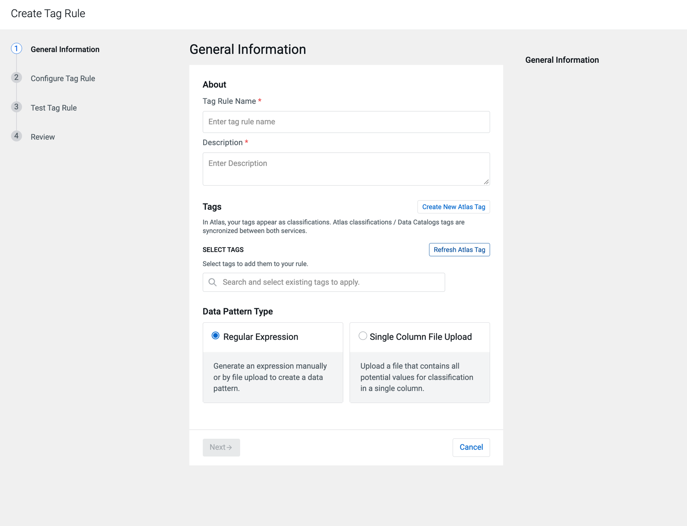
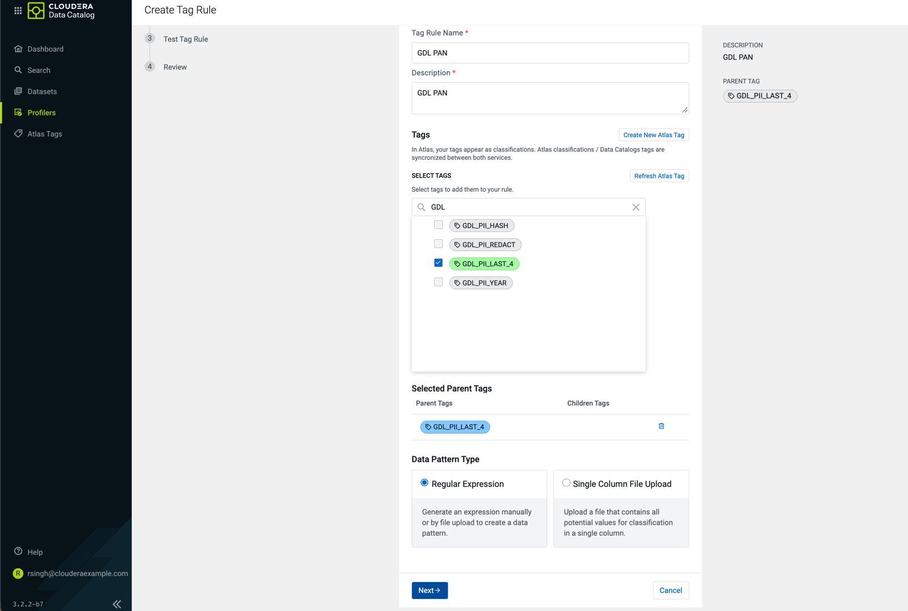
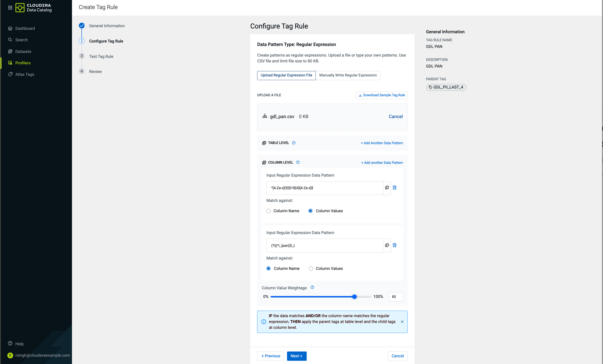
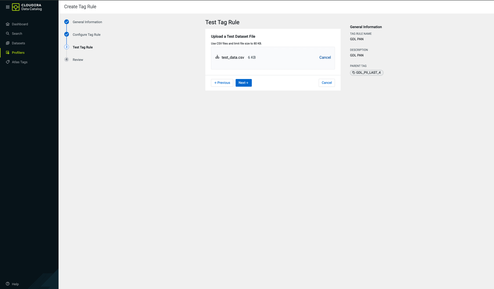
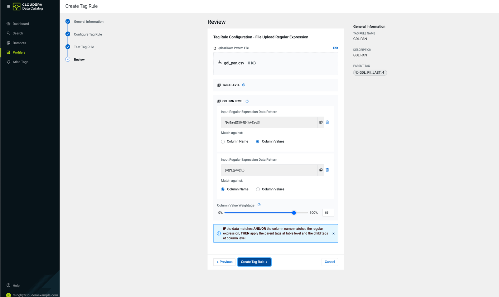

# Creating the profiler tag rules in Data Catalog

The seven tag rules that let the Data Compliance profiler apply the `GDL_PII_*` tags by
itself (why and how they score: [GOVERNANCE.md](GOVERNANCE.md#auto-classification-data-catalog-profiler-tag-rules)).
The rules are defined in `config/profiler_tag_rules.json`; `python scripts/profiler_rules.py
render` writes the upload files used below to `governance/profiler/`.

Prerequisites: the profilers are launched on the data lake (Profilers > Setup Profiler), and
the `GDL_PII_*` classifications exist in Atlas (`scripts/governance.py apply` creates them).

## The rules

| Tag Rule Name | Description | Tag | Upload file | Column Value Weightage | Test columns it should tag |
|---|---|---|---|---|---|
| GDL PAN | Indian Permanent Account Number (AAAAA9999A), by value | `GDL_PII_LAST_4` | `gdl_pan.csv` | 85 | `pan` |
| GDL Aadhaar | Aadhaar number, 12 digits; needs the column name too | `GDL_PII_LAST_4` | `gdl_aadhaar.csv` | 50 | `aadhaar` |
| GDL Mobile | Indian mobile number, any of the source formats | `GDL_PII_LAST_4` | `gdl_mobile.csv` | 85 | `mobile` |
| GDL Account number | Bank account number in a column named for it; join keys stay unmasked | `GDL_PII_LAST_4` | `gdl_account_number.csv` | 30 | `acct_no` |
| GDL E-mail | E-mail address, by value | `GDL_PII_HASH` | `gdl_e_mail.csv` | 85 | `email` |
| GDL Person name | A person's name, by column name | `GDL_PII_HASH` | `gdl_person_name.csv` | 20 | `first_name`, `last_name`, `full_name` |
| GDL Postal address | Street address, by column name | `GDL_PII_REDACT` | `gdl_postal_address.csv` | 20 | `addr_line1`, `address` |

`branch_name`, `product_name`, `debtor_account`, `loan_id` and `pincode` in the test file
must not be tagged by any rule: they look like names, account numbers or addresses but are
not personal data.

## Steps, once per rule

Data Catalog > Profilers > Tag Rules > Create Tag Rule. The screenshots are of GDL PAN.

**1. General Information.** Enter the Tag Rule Name and the Description from the table.

Under Select Tags, search `GDL` and tick the rule's tag; it shows under Selected Parent Tags.
Leave the Data Pattern Type on Regular Expression, then Next.

**2. Configure Tag Rule.** Choose Upload Regular Expression File and upload the rule's file
from `governance/profiler/`. The patterns load under Column Level: one or more matched
against Column Values, one or more against Column Name (the UI shows the file as 0 KB; it is
a few hundred bytes). Leave Table Level empty. Set Column Value Weightage from the table,
then Next.

Instead of the file, Manually Write Regular Expression takes the same patterns: copy them
from the file's `regex` column, with Match against set from its `matchType` column
(`columnValue` is Column Values, `columnName` is Column Name).

**3. Test Tag Rule.** Upload `governance/profiler/test_data.csv`, then Next. The columns
tagged should be the ones in the last column of the table above, and no others.

**4. Review.** Check the tag, the patterns with their Match against, and the weightage, then
Create Tag Rule.

## After the seven rules

1. Data Compliance profiler > Configuration: an allow-list asset filter rule, Database name
   starts with `rsingh_gdl_`, and incremental profiling on.
2. Dry Run the rules on a few tables (for example `rsingh_gdl_silver.cbs_customer`,
   `rsingh_gdl_silver.pay_transaction`, `rsingh_gdl_gold.dim_party`), then Enable them.
3. After the profiler has run, review the suggested tags (Job History > Profiled Assets, or
   `cdp datacatalog get-suggested-tags`) and approve them.
4. Set `"profiler_tags_on_tables": true` in `config/governance.json`, so `governance.py
   apply` leaves the profiler's tags on table columns.

To use the rules for another project, widen the asset filter. The `GDL_PII_*` tags carry
this project's masking policies, so every column they tag is masked for `federal01` and
`federal07`; a project with its own masking should copy the rules onto its own tags.
