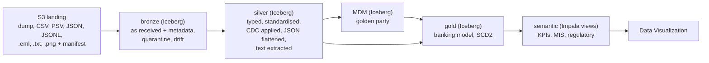

# Q3. Structured, semi-structured and unstructured data in one lakehouse on an open table format

## The short answer

Yes. All three kinds land in the same place, go through the same bronze job, and are stored as
**Apache Iceberg** tables in one catalog (the data lake's Hive metastore) on one S3 location,
in layered databases: `rsingh_gdl_bronze`, `_silver`, `_mdm`, `_gold`, `_semantic` and `_ref`.
Spark on CDE writes them; Impala on CDW, Hue and Data Visualization read the same tables;
Atlas and Ranger govern them. No copy per engine, no separate document store.

Be precise when asked "a single database": it is one lakehouse catalog and one table format,
with a database per layer, which is the usual medallion layout. Every table, including the
documents, is Iceberg; the semantic layer is views over them.

## What arrives

| Kind | Source | Format on landing | Bronze table |
|---|---|---|---|
| Structured | Core banking (MySQL) | `mysqldump` (`CREATE TABLE` + `INSERT`) | `cbs_customer`, `cbs_account`, `cbs_branch`, `cbs_product` |
| Structured | Core banking end-of-day | CSV | `cbs_eod_balance` |
| Structured | Loans | pipe-delimited, header and trailer | `lms_borrower`, `lms_loan`, `lms_repayment` |
| Structured | Compliance | pipe-delimited | `aml_watchlist` |
| Semi-structured | Core banking CDC | JSON events (Debezium style: `op`, `before`, `after`, binlog position) | `cbs_cdc_event` |
| Semi-structured | Payments | nested JSON lines (debtor, creditor, amount, charges array; `device` appears on D4) | `pay_transaction` |
| Semi-structured | CRM | JSON array of profiles (nested identifiers) | `crm_customer` |
| Unstructured | Documents | `.eml` e-mails, KYC declarations (text), KYC scans (PNG) | `doc_document` |

## The flow



How each kind is handled:

- **Structured.** Parsed by format (the dump in `CREATE TABLE` column order, CSV and PSV by
  header), checked against the contract, typed in silver.
- **Semi-structured.** Bronze keeps the whole JSON in `payload` and extracts the contract's
  fields by JSON path; unknown fields are logged in `ref.schema_drift`. Silver flattens:
  payments become one row per message with fees and GST from the `charges` array; CDC events
  are applied to the state tables in source-timestamp order.
- **Unstructured.** Bronze stores the file itself in a `binary` column (`content`), with
  `mime_type`, `bytes`, `sha256` and, for text files, `text_content`. Silver `doc_extract`
  reads entities out of the text (customer id, account number, PAN, mobile, address, intent
  such as `ADDRESS_CHANGE` or `KYC_DECLARATION`) and the image size from the PNG header. MDM
  then uses them: a customer's address-change e-mail can win survivorship for the address.

## Demo, about 6 minutes

**1. The landing zone (1 min).** Hue file browser, one date folder: a dump, a JSON lines file,
an `.eml` and a `.png` side by side, with the manifest.

**2. One format, three kinds (2 min).** In Hue:

```sql
SHOW CREATE TABLE rsingh_gdl_bronze.doc_document;        -- STORED AS ICEBERG, content BINARY
SELECT file_name, mime_type, bytes, substr(text_content, 1, 120)
FROM rsingh_gdl_bronze.doc_document WHERE _business_date = DATE '2026-09-24';
SELECT msg_id, substr(payload, 1, 120) FROM rsingh_gdl_bronze.pay_transaction LIMIT 3;
SELECT cust_id, first_name, pan, _source_file, _source_row FROM rsingh_gdl_bronze.cbs_customer LIMIT 3;
```

**3. Unstructured to structured (2 min).**

```sql
SELECT file_name, doc_type, intent, cust_id, account_key, pan_std, address_text, extraction_status
FROM rsingh_gdl_silver.doc_extract WHERE business_date = DATE '2026-09-24';
```

Then the payoff: `rsingh_gdl_mdm.document_party` links each document to a golden party, and
Shreya Naidu's address in `golden_party` came from her e-mail `EML-20260924-0001.eml` (see Q4).

**4. Same tables, any engine (1 min).** The bronze and silver tables were written by Spark on
CDE and are being read in Impala; Atlas shows them as `iceberg_table` entities.

## Follow-ups to expect

- **"Why Iceberg?"** ACID commits per entity (a failed load leaves nothing half written, see
  Q7), snapshots and time travel (Q4), schema evolution, partition replace for idempotent
  re-runs, and one copy readable by Spark, Impala and Hive.
- **"Do you store big files in a table?"** Here the documents are small, so bytes in a binary
  column are fine. For large media the pattern is the file on S3 and its path, hash and
  metadata in the table.
- **Masking:** raw `payload`, `text_content` and the binary `content` are masked for federal01
  and federal07 like the personal columns.
